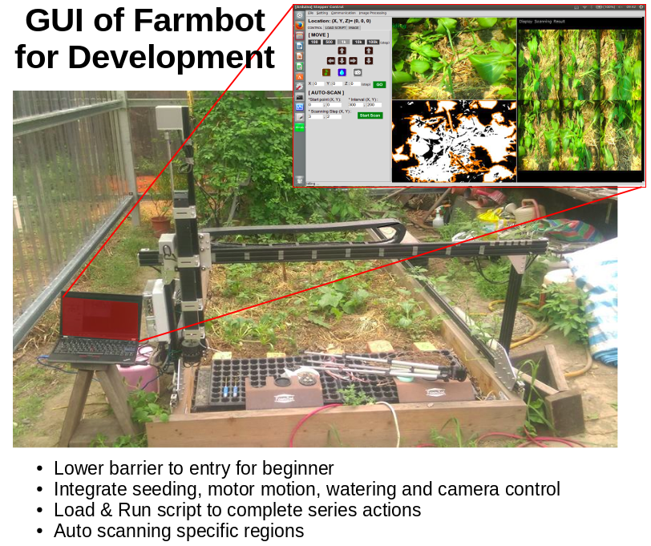
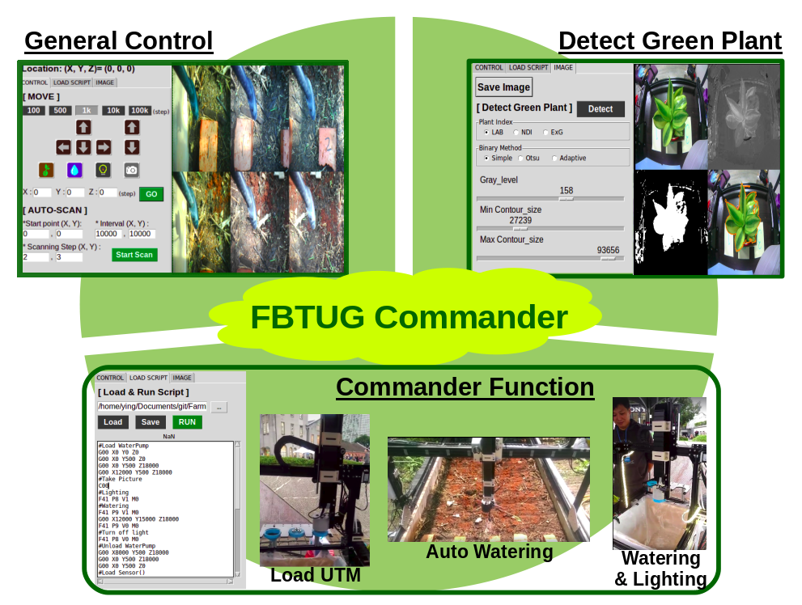
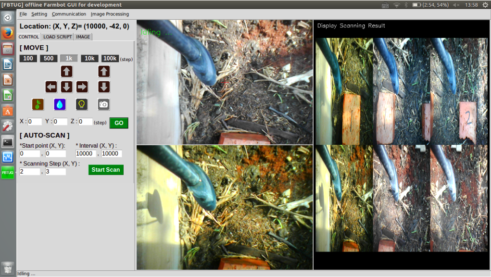
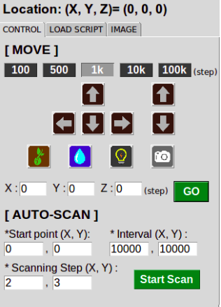
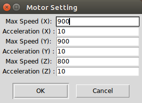
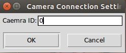
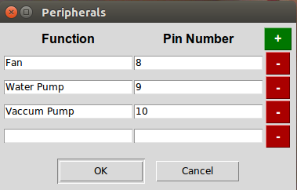
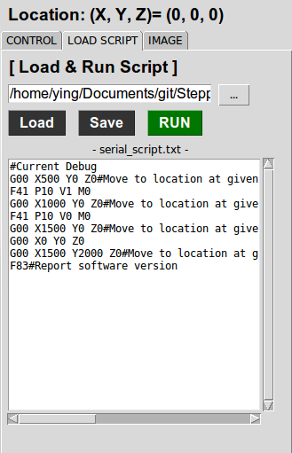
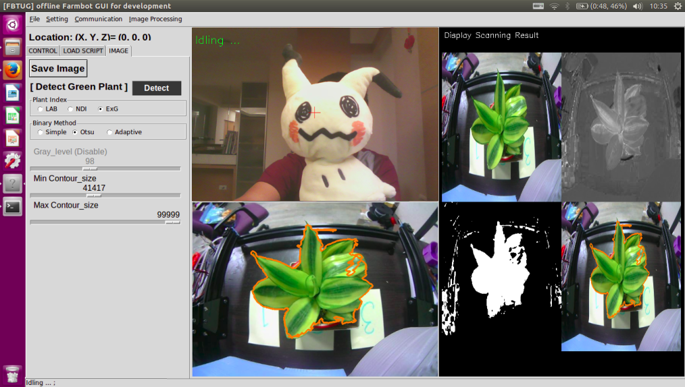

FBTUG Commander for Development
==========================
  

The Python code with a user interface is porvided with following functions:
1. 3-axis stepper-motor control
2. auto scanning function by setting start point, scanning interval and scanning amount
3. real-time image display 
4. Load & Run script function
5. Detect Green Plant function(LAB, ExG and NDI method are provided here)
6. Motor Setting function (MAX speed, Acceleration)
7. Camera Setting (Camera ID)
8. Peripheral Setting (PIN Number)



> * The communication between Arduino and computer is automatically built when the program is opened. If the connection is failed, it can be re-built again by clicking the 'Connect to Arduino' button in menubar  
> * The communication between Camera and computer is automatically built when the program is opened. If the connection is failed, it can be re-built again by clicking the 'Connect to Camera' button in menubar  
> * The parameters on UI are saved automatically after the program is closed.   

Move Control 
-----------------------
  
<Hot Key>  
move amount(100, 500, 1k, 10k, 100k):  F1~F5  
Up, Down, Left, Right: ↑, ↓, ←, →  
Z-Up, Z-Down: ctrl+↑, ctrl+↓  
  
Motor Setting 
-----------------------
  

Camera Setting
-----------------------
  

Peripheral Setting
-----------------------
  

Load & Run Script
-----------------------
  
The commands for arduino could be sent by FBTUG_Commander. However not only arduino code but aslo other functions, like grabbing image or making schedule in the future, could be applied here.  

### Code sent to RPI (defined by FBTUG)
Code type|Number|Parameters|Function
---------|------|----------|--------
C        |      |          |Camera command, commands for controlling camera
C        |00    |          |Save image
T        |00    |h m s     |(Not added yet) Delay h hours, m mintus, s seconds
T        |01    |h m s     |(Not added yet) Wait until it is at h:m:s
    
### Codes sent to the arduino (defined by Farmbot https://github.com/FarmBot/farmbot-arduino-firmware )
Code type|Number|Parameters|Function
---------|------|----------|--------
G        |      |          |G-Code, the codes working the same as a 3D printer
G        |00    |X Y Z S   |Move to location at given speed for axis (don't have to be a straight line), in absolute coordinates
G        |01    |X Y Z S   |Move to location on a straight line
G        |28    |          |Move home all axis
F        |      |          |Farm commands, commands specially added for the farmbot
F        |01    |T         |Dose amount of water using time in millisecond
F        |02    |N         |Dose amount of water using flow meter that measures pulses
F        |09    |          |Reset emergency stop
F        |11    |          |Home X axis
F        |12    |          |Home Y axis
F        |13    |          |Home Z axis
F        |14    |          |Calibrate X axis
F        |15    |          |Calibrate Y axis
F        |16    |          |Calibrate Z axis
F        |20    |          |List all parameters and value
F        |21    |P         |Read parameter
F        |22    |P V       |Write parameter
F        |23    |P V       |Update parameter (during calibration)
F        |31    |P         |Read status
F        |32    |P V       |Write status
F        |41    |P V M     |Set a value V on an arduino pin in mode M (digital=0/analog=1)
F        |42    |P M       |Read a value from an arduino pin P in mode M (digital=0/analog=1)
F        |43    |P M       |Set the I/O mode M (input=0/output=1) of a pin P in arduino
F        |44    |P V W T M |Set the value V on an arduino pin P, wait for time T in milliseconds, set value W on the arduino pin P in mode M (digital=0/analog=1)
F        |51    |E P V     |Set a value on the tool mount with I2C (not implemented)
F        |52    |E P       |Read value from the tool mount with I2C (not implemented)
F        |61    |P V       |Set the servo on the pin P (only pin 4 and 5) to the requested angle V
F        |81    |          |Report end stop
F        |82    |          |Report current position
F        |83    |          |Report software version
F        |84    |X Y Z     |Set axis current position to zero (yes=1/no=0)
E        |      |          |Emergency stop

### Parameters for commands  
Parameters|Description            |Unit of Measurement
----------|-----------------------|-------------------
X         |X movement             |steps
Y         |Y movement             |steps
Z         |Z movement	          |steps

### Arduino parameter numbers
ID   | Name
-----|----------------------------
41   | MOVEMENT_STEPS_ACC_DEC_X
42   | MOVEMENT_STEPS_ACC_DEC_Y
43   | MOVEMENT_STEPS_ACC_DEC_Z
71   | MOVEMENT_MAX_SPD_X
72   | MOVEMENT_MAX_SPD_Y
73   | MOVEMENT_MAX_SPD_Z

### Codes sent to the arduino
e.g. Moving 100, 200, 300 steps on X & Y & Z direction respectively
```
G00 X100 Y200 Z300
```
e.g. Read the Parameter Value of X acceleration
```
F21 P41
```
e.g. Change the Parameter Value of Y acceleration to 300
```
F22 P41 V300
```
P.S. The oservation speed could be changed by setting MOVEMENT_MAX_SPD or MOVEMENT_STEPS_ACC_DEC  

Image Processing 
-----------------------

The functions to detect GREEN Plant in the image. Three Plant Indexes, LAB, ExG and NDI, are provided. Threshold method could be changed here too. 
  
command line for start FBTUG_Commander: 
-----------------------
```
sudo python gui_main.py
```

Command line for install Arudino and its related lib
-----------------------
```
sudo apt-get install arduino gcc-avr avr-libc avrdude python-configobj python-jinja2 python-serial
mkdir tmp
cd tmp
git clone https://github.com/miracle2k/python-glob2
cd python-glob2
wget https://bootstrap.pypa.io/ez_setup.py -O - | sudo python
sudo python setup.py install
git clone git://github.com/amperka/ino.git
cd ino
sudo make install
cd ~/tmp/
git clone  https://github.com/FarmBot/farmbot-arduino-firmware
cd farmbot-arduino-firmware
ino build
ino upload
```

Command Line for install openCV and its environments
-----------------------
```
sudo apt-get -y update
sudo apt-get -y upgrade
sudo apt-get -y dist-upgrade
sudo apt-get -y autoremove

sudo apt-get install -y build-essential cmake
sudo apt-get install -y python-dev python-tk python-numpy python3-dev python3-tk python3-numpy
sudo apt-get install -y python-imaging-tk sudo python-tk idle python-pmw python-imaging
sudo apt-get install -y libgtk2.0-dev
sudo apt-get install -y qt5-default libvtk6-dev
sudo apt-get install -y zlib1g-dev libjpeg-dev libwebp-dev libpng-dev libtiff5-dev libjasper-dev libopenexr-dev libgdal-dev
sudo apt-get install -y libtbb-dev libeigen3-dev
sudo apt-get install -y ant default-jdk
sudo apt-get install -y doxygen

git clone https://github.com/opencv/opencv.git
cd opencv
git checkout 2.4
mkdir build
cd build
sudo cmake -D CMAKE_BUILD_TYPE=RELEASE -D CMAKE_INSTALL_PREFIX=/usr/local -D BUILD_NEW_PYTHON_SUPPORT=ON -D INSTALL_C_EXAMPLES=ON -D INSTALL_PYTHON_EXAMPLES=ON -D WITH_FFMPEG=OFF -D BUILD_EXAMPLES=ON ..
sudo make -j4
sudo make install
sudo ldconfig
```
   
Python lib
-----------------------
Tkinter  
opencv  
python-serial  
