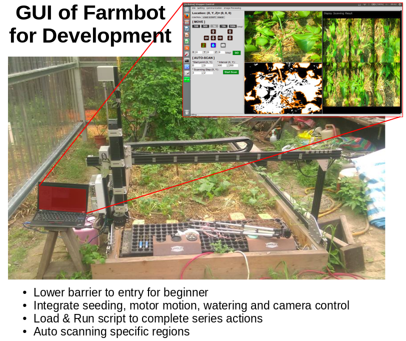
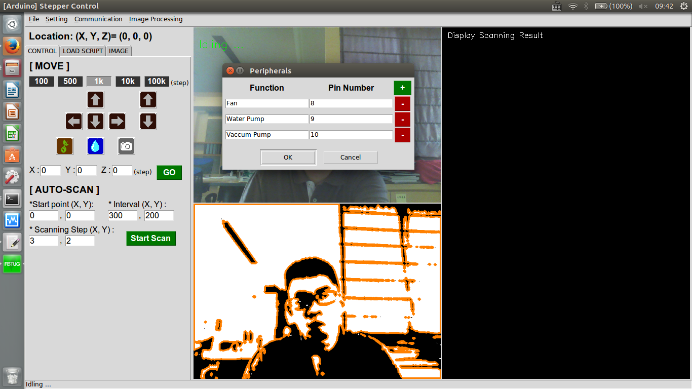
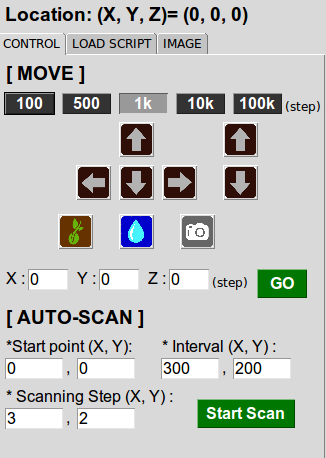
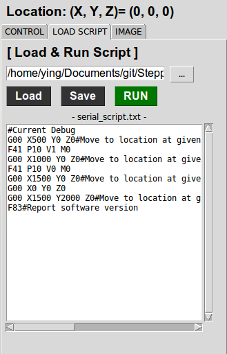
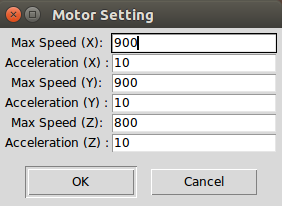
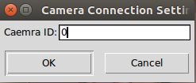
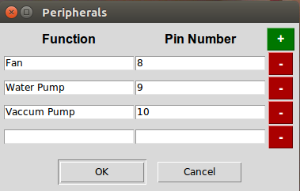

Offlien GUI of Farmbot for Development
==========================

The Python code with a user interface is porvided with following functions:
1. 3-axis stepper-motor control
2. auto scanning function by setting start point, scanning interval and scanning amount
3. real-time image display 
4. Load & Run script function
5. image processing function(otsu method is provided here)
6. Motor Setting function (MAX speed, Acceleration)
7. Camera Setting (Camera ID)
8. Peripheral Setting (PIN Number)



> * The communication between Arduino and computer is automatically built when the program is opened. If the connection is failed, it can be re-built again by clicking the 'Connect to Arduino' button in menubar  
> * The communication between Camera and computer is automatically built when the program is opened. If the connection is failed, it can be re-built again by clicking the 'Connect to Camera' button in menubar  
> * The parameters on UI are saved automatically after the program is closed.   

Move Control 
-----------------------
  
<Hot Key>  
move amount(100, 500, 1k, 10k, 100k):  F1~F5  
Up, Down, Left, Right: ↑, ↓, ←, →  
Z-Up, Z-Down: ctrl+↑, ctrl+↓  
  
Load & Run Script
-----------------------
  

Motor Setting 
-----------------------
  

Camera Setting
-----------------------
  

Peripheral Setting
-----------------------
  


```command line: 
sudo python gui_main.py
```

Arduino Code
-----------------------
Reference by Farmbot:
    https://github.com/FarmBot/farmbot-arduino-firmware 

### Parameters for commands  
Parameters|Description            |Unit of Measurement
----------|-----------------------|-------------------
X         |X movement             |steps
Y         |Y movement             |steps
Z         |Z movement	          |steps

### Arduino parameter numbers
ID   | Name
-----|----------------------------
41   | MOVEMENT_STEPS_ACC_DEC_X
42   | MOVEMENT_STEPS_ACC_DEC_Y
43   | MOVEMENT_STEPS_ACC_DEC_Z
71   | MOVEMENT_MAX_SPD_X
72   | MOVEMENT_MAX_SPD_Y
73   | MOVEMENT_MAX_SPD_Z

### Codes sent to the arduino
e.g. Moving 100, 200, 300 steps on X & Y & Z direction respectively
```
G00 X100 Y200 Z300
```
e.g. Read the Parameter Value of X acceleration
```
F21 P41
```
e.g. Change the Parameter Value of Y acceleration to 300
```
F22 P41 V300
```

P.S. The oservation speed could be changed by setting MOVEMENT_MAX_SPD or MOVEMENT_STEPS_ACC_DEC

Command line for install Arudino and its related lib
-----------------------
```
sudo apt-get install arduino gcc-avr avr-libc avrdude python-configobj python-jinja2 python-serial
mkdir tmp
cd tmp
git clone https://github.com/miracle2k/python-glob2
cd python-glob2
wget https://bootstrap.pypa.io/ez_setup.py -O - | sudo python
sudo python setup.py install
git clone git://github.com/amperka/ino.git
cd ino
sudo make install
cd ~/tmp/
git clone  https://github.com/FarmBot/farmbot-arduino-firmware
cd farmbot-arduino-firmware
ino build
ino upload
```

Command Line for install openCV and its environments
-----------------------
```
sudo apt-get -y update
sudo apt-get -y upgrade
sudo apt-get -y dist-upgrade
sudo apt-get -y autoremove

sudo apt-get install -y build-essential cmake
sudo apt-get install -y python-dev python-tk python-numpy python3-dev python3-tk python3-numpy
sudo apt-get install -y python-imaging-tk sudo python-tk idle python-pmw python-imaging
sudo apt-get install -y libgtk2.0-dev
sudo apt-get install -y qt5-default libvtk6-dev
sudo apt-get install -y zlib1g-dev libjpeg-dev libwebp-dev libpng-dev libtiff5-dev libjasper-dev libopenexr-dev libgdal-dev
sudo apt-get install -y libtbb-dev libeigen3-dev
sudo apt-get install -y ant default-jdk
sudo apt-get install -y doxygen

git clone https://github.com/opencv/opencv.git
cd opencv
git checkout 2.4
mkdir build
cd build
sudo cmake -D CMAKE_BUILD_TYPE=RELEASE -D CMAKE_INSTALL_PREFIX=/usr/local -D BUILD_NEW_PYTHON_SUPPORT=ON -D INSTALL_C_EXAMPLES=ON -D INSTALL_PYTHON_EXAMPLES=ON -D WITH_FFMPEG=OFF -D BUILD_EXAMPLES=ON ..
sudo make -j4
sudo make install
sudo ldconfig
```
   
Python lib
-----------------------
Tkinter  
opencv  
python-serial  
